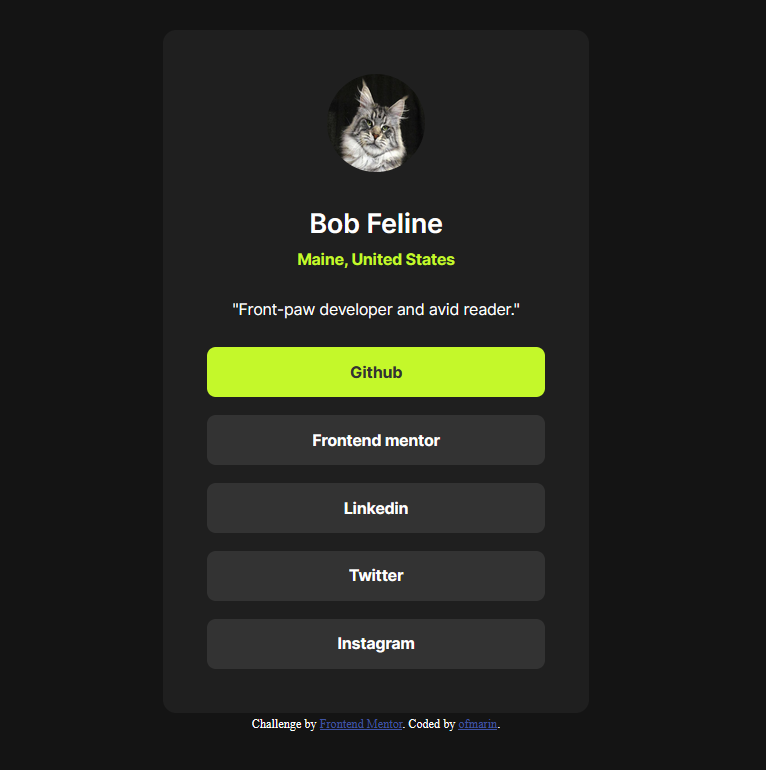

# Frontend Mentor - Social links profile solution

This is a solution to the [Social links profile challenge on Frontend Mentor](https://www.frontendmentor.io/challenges/social-links-profile-UG32l9m6dQ). Frontend Mentor challenges help you improve your coding skills by building realistic projects. 

## Table of contents

- [Overview](#overview)
  - [The challenge](#the-challenge)
  - [Screenshot](#screenshot)
  - [Links](#links)
- [My process](#my-process)
  - [Built with](#built-with)
  - [What I learned](#what-i-learned)
  - [Continued development](#continued-development)
  - [Useful resources](#useful-resources)
  - [AI Collaboration](#ai-collaboration)
- [Author](#author)

## Overview

### The challenge

Users should be able to:

- See hover and focus states for all interactive elements on the page

### Screenshot

### Links

- Solution URL: [Repository](https://github.com/ofmarin/social-links-profile)
- Live Site URL: [Live site](https://ofmarin.github.io/social-links-profile/)

## My process

### Built with

- Semantic HTML5 markup
- Flexbox
- Mobile-first workflow
- [angular](https://angular.dev/) - JS library

### What I learned

- Learned about the browser set styles given to elements like h1, and how to remove them.

### Continued development

Use this section to outline areas that you want to continue focusing on in future projects. These could be concepts you're still not completely comfortable with or techniques you found useful that you want to refine and perfect.
Angular, Angular, and some more Angular. For now it seems heavy to build Angular projects for smaller
challenges, but it definitely is appreciate as I can build a solid Foundation.

### Useful resources

The classics, Stack overflow, dev.to, mdn, etc.

### AI Collaboration

Describe how you used AI tools (if any) during this project. This helps demonstrate your ability to work effectively with AI assistants.

- Gemini.
- when i got tired or the problems where too specific I asked gemini for guidance.
- Solid for boiler plate, or some solutions. But it often misses the mark and over complicates stuff.

## Author

- Website - Still don't have a website, but probably soon enough.
- Frontend Mentor - [ofmarin](https://www.frontendmentor.io/profile/ofmarin)

